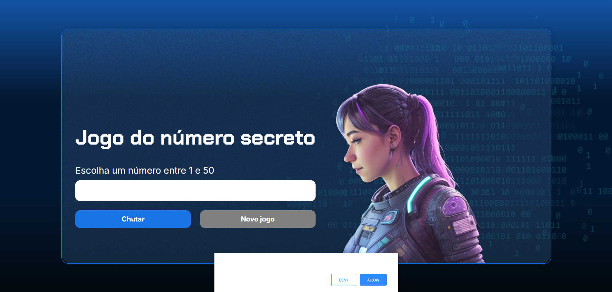

## 🎯 Jogo do Número Secreto
Este é um jogo simples e interativo criado com HTML, CSS e JavaScript, onde o objetivo é adivinhar um número secreto escolhido aleatoriamente pelo sistema entre 1 e 50. O jogo também utiliza a biblioteca ResponsiveVoice para leitura em voz das mensagens na tela.

## 📸 Preview

## 🚀 Funcionalidades
- ✅ Geração aleatória de número secreto entre 1 e 50
- ✅ Verificação de tentativas do jogador
- ✅ Feedback dinâmico informando se o número é maior ou menor que o chute
- ✅ Feedback em voz com a biblioteca responsiveVoice.js
- ✅Histórico para evitar repetição de números
- ✅ Botão para reiniciar o jogo com novo número secreto

## 🛠 Tecnologias utilizadas
- ✅ HTML5
- ✅ CSS3
- ✅ JavaScript
- ✅ ResponsiveVoice (API de síntese de voz)

## ✍️ Como jogar
* Digite um número entre 1 e 50 no campo de entrada.
* Clique no botão "Chutar".
* O jogo indicará se o número é maior, menor ou se você acertou.
* Ao acertar, o botão "Novo jogo" será habilitado para jogar novamente.

## 📢 Observações
* Os números sorteados são registrados em uma lista para evitar repetições.
* A voz utilizada é a Brazilian Portuguese Female da biblioteca ResponsiveVoice.

## 🙋‍♀️ Sobre Mim

  

  Desenvolvido com 💙 por <strong>Sílvia Avelar</strong>

  
  &nbsp;
  

Entre em contato ou veja outros projetos!
